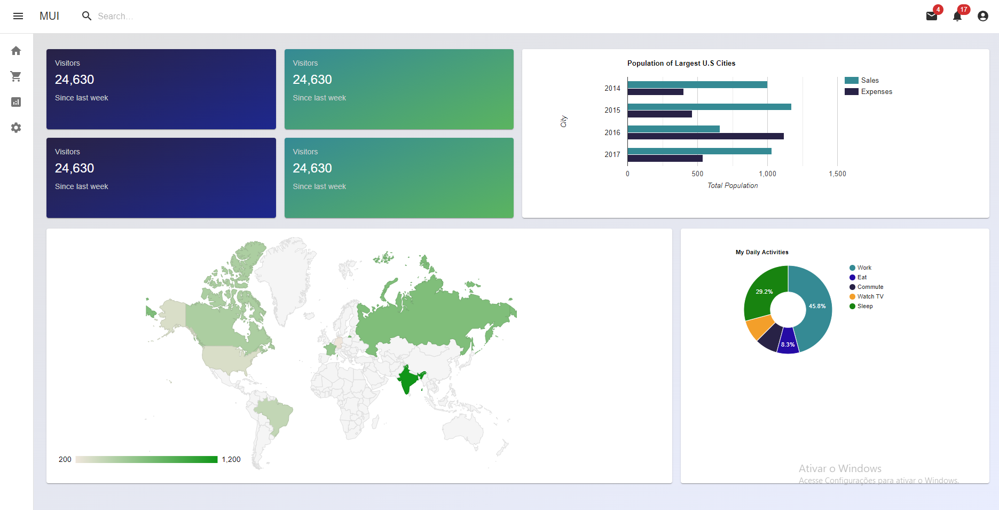

# MUI project Example
Projeto de estudos sobre Material UI + gráficos.

As libs que utilizei foram:
``` 
npm install @mui/material @emotion/react @emotion/styled @mui/icons-material react-router-dom zustand
```

## Gráficos
Testei com dois estilos de gráficos:
### Google Charts
[React Google Charts docs](https://www.react-google-charts.com/examples/)
`npm install --save react-google-charts`
### MUI Charts
[MUI X Charts docs](https://mui.com/x/react-charts/)
`npm install @mui/x-charts`

## React CountUp
[React CountUp](https://www.npmjs.com/package/react-countup)
`npm i react-countup`

Você não precisa instalar nenhum dos comandos acima, os anotei apenas para fins didáticos.

## Instalação

### `npm i`
### `npm start`
